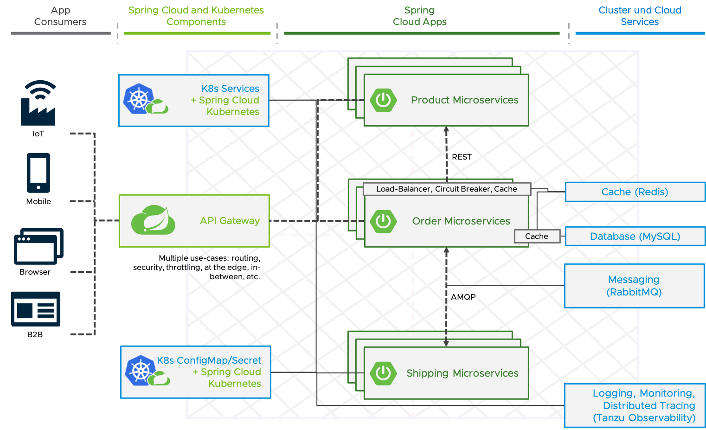

# Demo for a typical Spring Cloud Architecture on Kubernetes

**See repository [here](https://github.com/tsalm-pivotal/spring-cloud-demo) for the same application deployed on TAS/PCF/CF**

**See repository [here](https://github.com/tsalm-pivotal/spring-cloud-demo-asc) for the same application deployed on Azure Spring Cloud**



## Deployment

1. Ensure you have a local Docker installed and running, then execute:
   ```
   CONTAINER_REGISTRY_PREFIX=<your-registry-prefix>  # If you are using Docker Hub as a registry the prefix is just your Docker Hub ID
   ./mvnw spring-boot:build-image -pl product-service -Dspring-boot.build-image.imageName=${CONTAINER_REGISTRY_PREFIX}/sc-product-service
   ./mvnw spring-boot:build-image -pl order-service -Dspring-boot.build-image.imageName=${CONTAINER_REGISTRY_PREFIX}/sc-order-service
   ./mvnw spring-boot:build-image -pl shipping-service -Dspring-boot.build-image.imageName=${CONTAINER_REGISTRY_PREFIX}/sc-shipping-service
   ./mvnw spring-boot:build-image -pl gateway -Dspring-boot.build-image.imageName=${CONTAINER_REGISTRY_PREFIX}/sc-gateway

   docker login # If you are not using Docker Hub you have to specify the host of the registry 
   docker push ${CONTAINER_REGISTRY_PREFIX}/sc-product-service
   docker push ${CONTAINER_REGISTRY_PREFIX}/sc-order-service
   docker push ${CONTAINER_REGISTRY_PREFIX}/sc-shipping-service
   docker push ${CONTAINER_REGISTRY_PREFIX}/sc-gateway
   ```
2. Create private registry secret resource
   ```
   kubectl create secret docker-registry regcred --docker-server=https://index.docker.io/v1/ --docker-username=<your-name> --docker-password=<your-pword> --docker-email=<your-email>
   ```
3. Pods with the spring-cloud-kubernetes dependency requires access to the Kubernetes API. 
   See information [here](https://docs.spring.io/spring-cloud-kubernetes/docs/current/reference/html/#service-account) and change/delete the [k8s-deployment/rbac.yaml](k8s-deployment/rbac.yaml) based on your requirements.       
4. Create all required Kubernetes resources
    ```
    kubectl create -f k8s-deployment
    ```

## API usage 

Set the host name of the `sc-gateway-service`. If service type LoadBalancer is supported in your cluster with
```
GATEWAY_HOST_NAME=$(kubectl get service sc-gateway-service -ojsonpath='{.status.loadBalancer.ingress[0].hostname}')
```
otherwise with 
```
GATEWAY_HOST_NAME=$(kubectl get service sc-gateway-service -ojsonpath='{.spec.clusterIP}')
```
 
- Fetch products:
	```
	curl http://${GATEWAY_HOST_NAME}/sc-product-service-service/api/v1/products
	```
- Fetch orders:
	```
	curl http://${GATEWAY_HOST_NAME}/sc-order-service-service/api/v1/orders
	```
- Create order (After 10 seconds the status of the order should be DELIVERED)
	```
	curl --header "Content-Type: application/json" --request POST \
	  --data '{"productId":1,"shippingAddress":"Test address"}' \
	  http://${GATEWAY_HOST_NAME}/sc-order-service-service/api/v1/orders
	```
 
